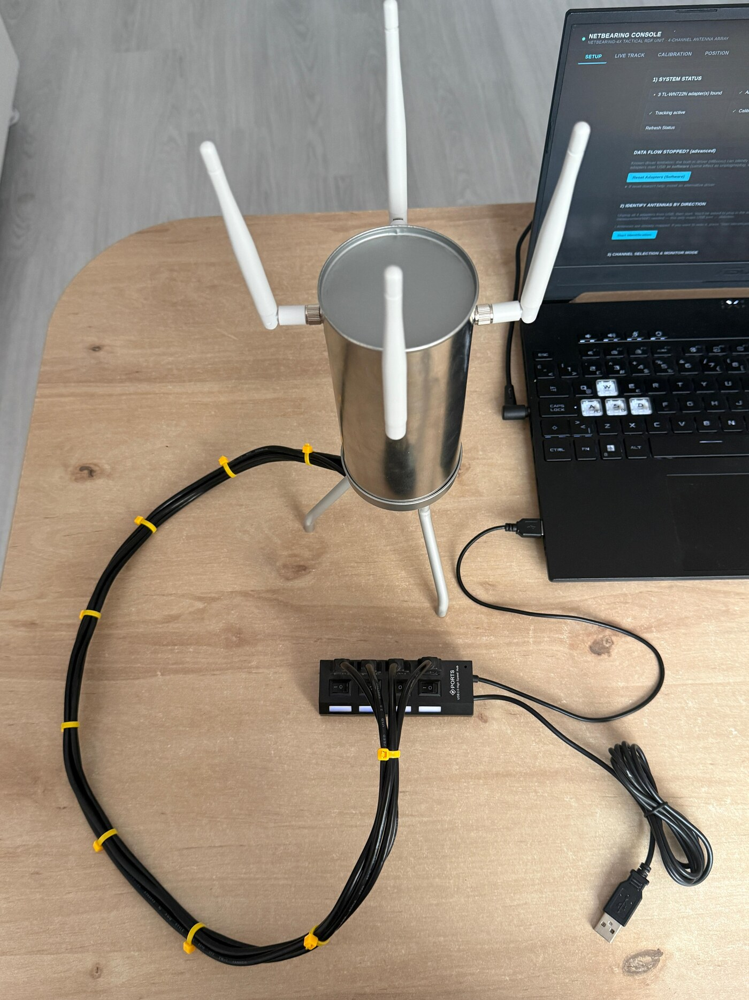
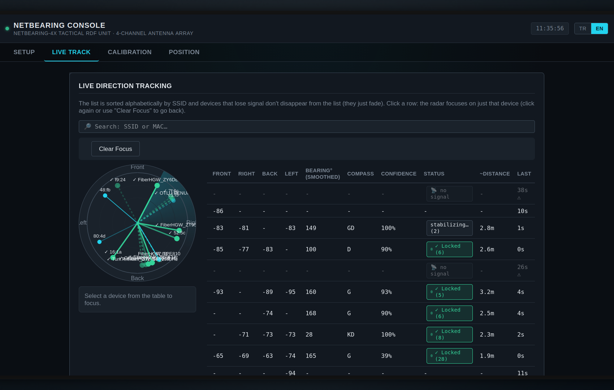
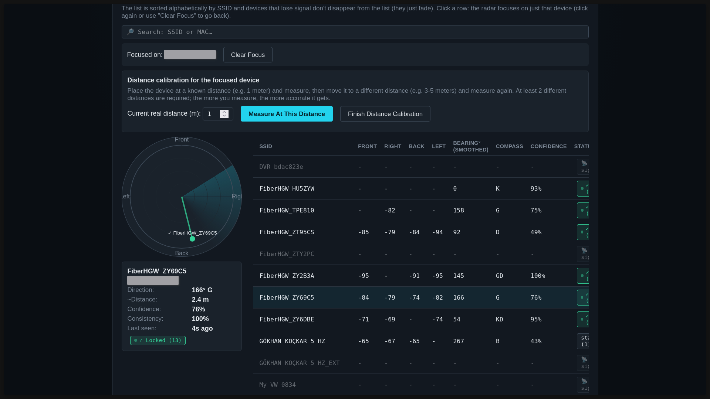
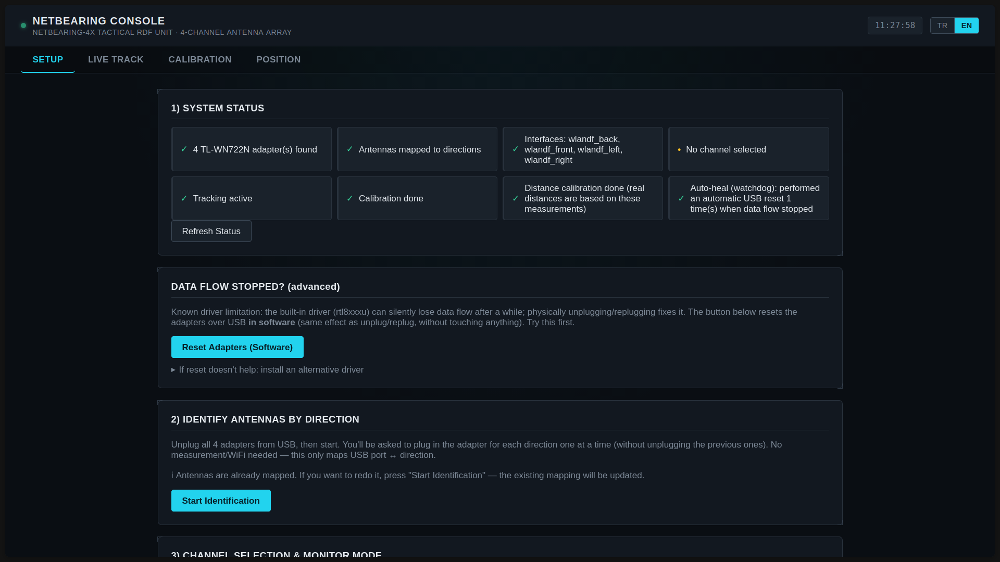
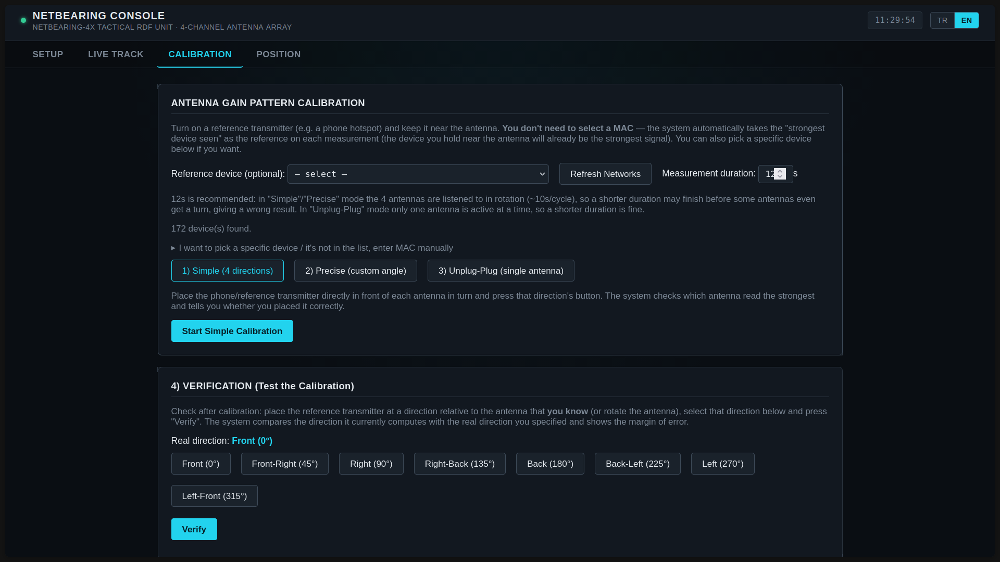
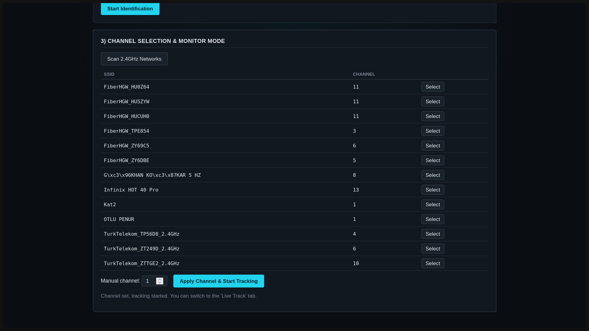
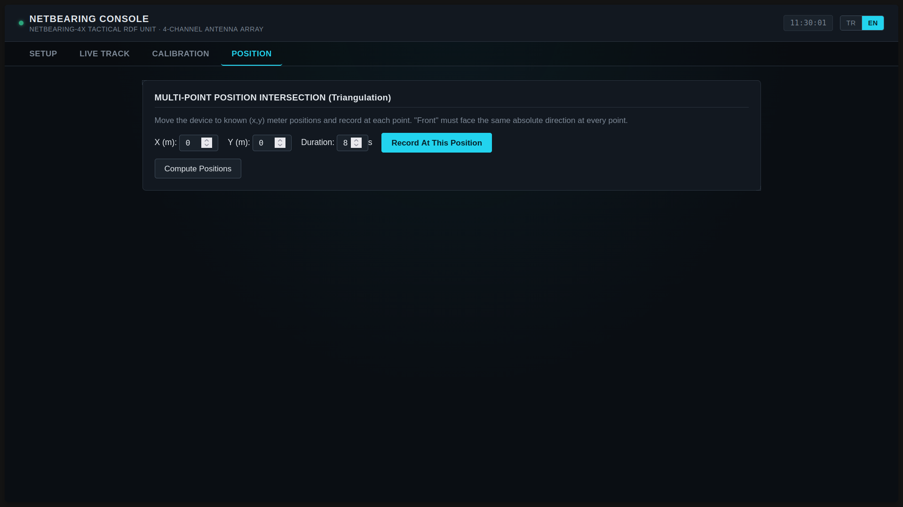
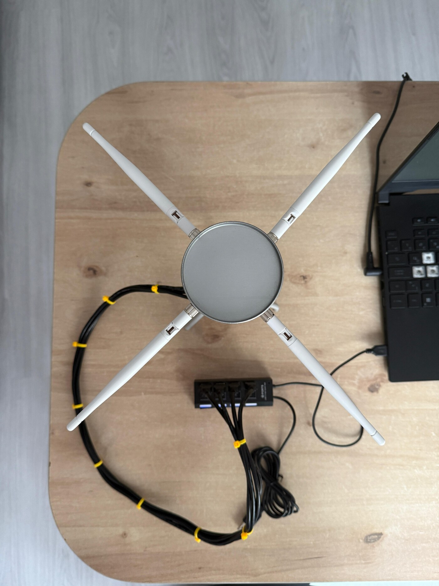

*English | [Türkçe](README.tr.md)*

# NetBearing Console — Software for the NetBearing-4X (4-Antenna WiFi Radio Direction Finder)

**NetBearing-4X** is the name of the hardware: four TL-WN722N v2 USB WiFi
adapters mounted on a cylindrical body, facing front/right/back/left.
**NetBearing Console** is the software that drives it, estimating the
**bearing** of detected WiFi devices and — by moving the device to multiple
known points, or by combining multiple fixed stations — their **position**.
It ships with full English/Turkish UI support and circular-Kalman-filter
based bearing smoothing.



## Screenshots

| Live track (multiple targets) | Live track (focused device) |
|---|---|
|  |  |

| Setup | Calibration |
|---|---|
|  |  |

| Channel selection | Position (triangulation) |
|---|---|
|  |  |

## Features

- **Web-based control panel** (English/Turkish): setup, live tracking,
  calibration and position fixing are all click-and-run in the browser.
- **Circular Kalman filter** for bearing smoothing: confidence-aware
  (down-weights low-quality readings), outlier-gated (a single bad sample
  can't throw it off), and "maneuver detection" (catches a genuine
  reorientation — the antenna array physically rotated — quickly instead of
  slowly converging toward it).
- **Self-healing capture**: a background watchdog automatically resets (at
  the USB level) any antenna whose data flow has stalled, and detects which
  direction is chronically underperforming to give it extra dwell time in
  the rotation.
- **Three calibration modes** (simple / precise / single-antenna) plus
  multi-station triangulation for high-accuracy position estimates.
- No need to type a MAC address by hand — the system automatically uses
  the strongest device currently in view as the reference (you can still
  pick one manually if you prefer).

## Hardware requirements



The reference hardware (**NetBearing-4X**) consists of:

- **4x TP-Link TL-WN722N v2/v3** USB WiFi adapters (Realtek RTL8188EUS
  chipset). **v1** uses a different chipset (Atheros AR9271) and was not
  tested with this project.
- A body/mount that fixes the adapters 90° apart, facing front/right/back/
  left (cylindrical or square — what matters is that all four antennas
  share a common center, are evenly spaced, and stay fixed relative to each
  other). Feel free to build your own enclosure; the software works with
  any 4-antenna array.
- **USB hub caveat:** hub quality matters when all 4 adapters share a
  single USB hub — see "Known hardware/driver limitations" below for
  details.
- Linux, with a reasonably recent kernel (in-tree `rtl8xxxu` monitor-mode
  support is recommended — details below).

## Web UI (recommended way to use this)

If you'd rather not touch the console, there's a browser-based control
panel. Everything from setup to live tracking runs from here,
click-and-run:

```bash
./start_gui.sh
```

(On first run it creates a venv and installs dependencies automatically.
The whole application — packet capture + web UI — runs as a **single**
root process; `pkexec` asks for your password **once**, then the browser
opens automatically and unprivileged — the root process never launches a
browser itself.) A shortcut was also added to your application menu:
you can launch it by clicking the **"NetBearing Console"** icon (no
terminal window needed).

The UI has 4 tabs:
- **Setup:** system status, antenna identification, network scanning and
  channel selection all happen here by clicking. USB software reset and
  alternative driver install (for troubleshooting) are also on this tab.
- **Live Track:** shows detected devices in a table plus a live "radar"
  view (bearing lines); click a device to focus on just that one.
- **Calibration:** measures and computes the antenna gain pattern via 3
  different methods (simple / precise / single-antenna).
- **Position:** takes multi-point (triangulation) station recordings and
  computes the resulting position fix.

This UI uses the `wifidf` Python package described below under the hood —
the same operations can also be done manually, step by step, via the
console commands further down.

The desktop shortcut (Terminal=false) never opens a console window; if
something goes wrong, first run `./start_gui.sh` once from a terminal to
see the error message.

**Architecture note:** since this is a single-user, personal tool meant to
run on your own machine, packet capture and the web server are combined
into ONE root process. This would NOT be the right design for a
multi-user/shared system (an HTTP server running as root, with no
privilege separation, is a larger attack surface on a system like that) —
but here, practicality/reliability (one process = fewer "processes can't
find each other" bugs) is the right tradeoff for this environment.

## Method (how it works)

This is the **amplitude-comparison direction finding (DF)** technique used
in amateur-radio "fox hunting":

1. 4 antennas share one location, 90° apart, each facing a different
   direction.
2. The RSSI a given transmitter produces on each antenna depends on that
   antenna's gain in that direction. Since the antennas are directional,
   the antenna facing closest to the transmitter reads the highest RSSI,
   and the one facing directly away reads the lowest.
3. Using the antenna gain pattern derived from calibration (`bearing.py`),
   a least-squares search finds the arrival angle that best fits the 4
   RSSI readings.
4. **A single station only yields a bearing, not a distance.** For
   high-accuracy **position**, move the device to 2+ different (known)
   points, record a bearing at each, and compute the intersection of these
   lines (`triangulate.py`) — this is the standard method used by real
   RDF/fox-hunting teams, and it is far more accurate than single-station
   RSSI-to-distance estimation.

Direct RSSI-to-distance estimation also exists (`distance.py`), but it is a
**rough** estimate (low accuracy due to multipath and environmental
variation); the real source of accuracy is the triangulation method.

## Hardware note: TL-WN722N v2

TL-WN722N **v1** uses the Atheros AR9271 chipset and gets direct monitor
mode support from in-tree Linux drivers (ath9k_htc). **v2/v3** use the
Realtek RTL8188EUS chipset. This usually needs an additional (out-of-tree)
driver for monitor mode + packet injection; `setup/install_driver.sh`
installs that driver (an aircrack-ng/rtl8188eus fork) via DKMS. **However**,
on newer kernels (tested on this machine: CachyOS, kernel 7.1.5) the
in-tree `rtl8xxxu` driver now supports monitor mode for these adapters too
(if `iw phy <phy> info` lists "monitor", you do NOT need to install the
extra driver). Since we only do passive listening (RSSI reading — no
packet injection needed), the in-tree driver is sufficient in most cases;
only try `install_driver.sh` if monitor mode can't be enabled via `iw`.

## Setup

```bash
cd /home/xen/Projeler/wifi-df
python3 -m venv .venv && source .venv/bin/activate
pip install -r requirements.txt
```

**Important — sudo + venv:** packages like `scapy` are installed inside the
venv, but running `sudo python3 ...` makes `sudo` ignore the venv and use
the **system** python3, giving a `ModuleNotFoundError: scapy` error. So use
the **full venv path** in every `sudo python3 scripts/...` command below:

```bash
sudo .venv/bin/python3 scripts/scan.py
```

(`setup/wizard.py` and `setup/identify_antennas.py` don't hit this issue,
since they don't use scapy / the wizard runs its own sudo calls as
separate commands.)

### Quick setup (recommended): the wizard

There's a wizard that checks and automates all of the manual steps 1–3
below (skipping any that are already done), logging each step with a
timestamp to `logs/wizard_*.log`:

```bash
python3 setup/wizard.py
```

In order it: checks Python dependencies → verifies the number of plugged-in
adapters → runs `identify_antennas.py` if antenna/direction mapping isn't
done yet (asks you to interact during the physical plug-in steps) → installs
and triggers the udev rule → scans nearby 2.4GHz networks and asks you to
pick one → puts all 4 antennas into monitor mode locked to the chosen
channel. At the end it prints the commands you need to run for calibration
and the dashboard.

Steps 1–3 below are the manual writeup of what the wizard does behind the
scenes — use them if the wizard doesn't work, or if you want to redo a
step by hand.

### 1) Driver install (applies to all 4 adapters, one-time)

```bash
bash setup/install_driver.sh
```

Uses an existing driver source under `~/rtl8188eus` if there is one;
otherwise clones it. After installing, plug in an adapter and confirm the
`8188eu` module loaded with `dmesg | tail`.

### 2) Identify antennas by direction

Whatever order the adapters get plugged into USB in, they get unpredictable
names like `wlan0`, `wlan1`, ... To map each adapter to the physical
direction you're currently plugging it into and generate a persistent
interface name (`wlandf_front` etc.):

```bash
sudo python3 setup/identify_antennas.py
```

The script will ask, in turn, "plug in the front adapter", "plug in the
right adapter", etc. At the end it generates two files; install them with
the printed commands:

```bash
sudo cp setup/99-wifi-df.rules /etc/udev/rules.d/
sudo cp setup/99-wifi-df-unmanaged.conf /etc/NetworkManager/conf.d/
sudo systemctl reload NetworkManager
sudo udevadm control --reload-rules
sudo udevadm trigger --action=add -s net
```

(`--action=add` matters: the default `trigger` sends a "change" event and
the renaming rule won't run. If that still doesn't work, unplug and replug
the adapters.) After this step, `data/device_config.json` is generated
automatically.

**Why USB port path (ID_PATH) instead of MAC?** On these adapters,
NetworkManager can assign a **random MAC** on every plug-in for privacy
reasons (even though the hardware's real/persistent MAC stays the same, the
address the interface shows changes). So the name mapping is keyed not to
the MAC, but to which physical USB port the adapter is wired to in the
enclosure (`ID_PATH`, which is immutable) — keep the antennas plugged into
the same physical USB ports after the initial identification. The
`99-wifi-df-unmanaged.conf` file takes these 4 interfaces entirely out of
NetworkManager's management, which both stops MAC randomization and
prevents NM from fighting with the channel/monitor-mode settings.

### 3) Monitor mode + channel lock

```bash
sudo bash setup/monitor_mode.sh 6   # 6 = the WiFi channel to listen on
```

Note: all 4 antennas must listen on the **same channel** (bearing
comparison only makes sense with simultaneous, same-channel readings).
Find the target's channel first, either with `scripts/scan.py` (by
temporarily scanning any one interface across channels) or with `iw scan`.

## Calibration (required, critical for accuracy)

Without calibrating the gain pattern, a default (rough) pattern is used;
for real-world accuracy, calibrate with your own antennas:

```bash
sudo .venv/bin/python3 scripts/scan.py       # first find a reference MAC (e.g. a phone hotspot)
sudo .venv/bin/python3 scripts/run_calibration.py --mac AA:BB:CC:DD:EE:FF --step 30 --duration 5
```

Hold the reference transmitter (a phone/hotspot with a known MAC) at a
fixed radius from the device and place it, in turn, at the angles the
script asks for (30° steps by default, 0 = front reference, clockwise). The
result is saved to `data/calibration/gain_pattern.json`.

To verify the algorithm without any hardware (using synthetic data):

```bash
python3 -m pytest tests/ -v
```

## Usage

### Live bearing tracking (dashboard)

```bash
sudo .venv/bin/python3 scripts/run_dashboard.py
```

Shows all detected devices, per-direction RSSI, the estimated bearing/
compass direction and confidence score in a live table.

### Position fix (triangulation) — for high accuracy

Move the device to known (x, y) meter positions and record at each one:

```bash
sudo .venv/bin/python3 scripts/record_station.py 0 0 --duration 8      # station 1
# move the device (e.g. 20 meters east)...
sudo .venv/bin/python3 scripts/record_station.py 20 0 --duration 8     # station 2
```

**Important:** the device's "front" reference must face the same absolute
direction (e.g. true North, aligned with a compass) at every station;
otherwise the bearings won't share a common coordinate frame.

Then compute the position estimate for all targets:

```bash
python3 scripts/fix_targets.py
```

## Accuracy and limitations

- **Bearing:** with 4 calibrated antennas, under static/low-noise
  conditions, expect error on the order of a few degrees (see the
  synthetic verification in `tests/test_bearing.py`). Multipath (indoor
  reflections) increases the error.
- **Single-station distance (from RSSI):** low accuracy, use only as a
  rough estimate.
- **Triangulated position (2+ stations):** the most accurate method; the
  larger the angular difference between stations (ideally around ~90°),
  the sharper/more accurate the intersection. If the stations are nearly
  collinear, the intersection becomes poorly conditioned.

### Known hardware/driver limitations

Anyone running this project on a different machine (different USB hub,
different kernel version) may run into the two limitations below. Both are
(partially) mitigated in software but can't be fully eliminated at the
hardware/driver level — so they're documented clearly here.

**1) rtl8xxxu + 4 simultaneous instances.** Running 4 RTL8188EUS-based
adapters on Linux's built-in `rtl8xxxu` driver in monitor mode AT THE SAME
TIME was observed to occasionally, silently stop data delivery on some
adapters (no error/exception) — this was verified repeatedly, INDEPENDENT
of power source (even with a powered external USB hub), thread count, or
capture architecture (single-thread / multi-thread / rotation). A single
antenna running in isolation was ALWAYS reliable — so by default this
project listens to the antennas in ROTATION rather than simultaneously
(see the `capture.py` docstring), and a background **watchdog** continuously
monitors packet counters; if one or two antennas "stall", it automatically
resets just those antennas at the USB level (without interrupting the
whole tracking session); if most/all stall, it does a full reset.

**2) Shared USB hub bandwidth bottleneck.** When all 4 adapters share a
SINGLE USB hub (especially a cheap/passive Full-Speed/12Mbit hub with a
single Transaction Translator), the hub's port-scheduling behavior can
systematically starve ONE direction relative to the others — even if that
antenna's radio is receiving packets fine (driver-level `/proc/net/dev`
counters grow normally), the data doesn't reach the computer over USB with
the same efficiency. To compensate, `capture.py` measures each direction's
actual packets/second rate over the last few rotation cycles and
automatically gives extra dwell time (capped, without delaying the others)
to any direction that falls noticeably below the group average.
**Recommendation:** where possible, connect the 4 adapters either (a)
spread across separate physical USB root/host controllers on the
motherboard, or (b) through a quality, externally-powered USB 3.0 hub —
both give noticeably better/more consistent results than a cheap
single-TT Full-Speed hub.

If either limitation persists:
1. Try "Reset Adapters (Software)" manually on the Setup tab.
2. Use the Calibration → "Unplug-Plug" mode (single-antenna isolation,
   unaffected by either limitation).
3. Try the alternative driver via `setup/install_alt_driver` (rtl8188eus,
   aircrack-ng) — but very new kernels (6.12+) may need build patches (see
   "Install Alternative Driver" on the Setup tab).
4. The diagnostic counters on the "Live Track" tab (`rate_pps`, `dwell_s`)
   show which direction is chronically falling behind — the
   `capture_stats` API response includes these values too.

## Scope of use

This tool passively listens to publicly broadcast WiFi frames
(beacon/probe/data frames); it does not attempt to connect to any network
or crack any password. That said, tracking/locating a specific person's
device may still be subject to privacy laws and local regulations — only
use it to test networks/devices you own, for authorized security/RF work,
or to locate your own equipment (e.g. a lost device, a source of
interference).

## Project layout

```
start_gui.sh        Launcher for the web UI (starts root via pkexec, opens the browser separately/unprivileged)
webapp/             Web-based control panel (recommended way to use this)
  app.py               Single-process Flask app (root; packet capture + web UI combined)
  static/                index.html, app.js, app.css (4-tab SPA)
wifidf/            Core Python package
  config.py           Direction<->interface mapping, angle definitions
  capture.py          Scapy-based 802.11/RSSI capture (4 interfaces, rotated)
  aggregator.py        Per-MAC sample aggregation + noise reduction
  bearing.py           Amplitude-comparison bearing-finding algorithm
  calibrate.py          Calibration routine
  distance.py            Rough RSSI->distance model
  triangulate.py           Multi-station bearing intersection
  station_log.py           Station/bearing log for triangulation
  tracker.py                Main capture+aggregate+bearing loop
  dashboard.py                rich-based live terminal UI
scripts/            Executable CLI entry points
setup/              Driver install, antenna identification, monitor mode scripts
  wizard.py           Wizard that checks/automates/logs all setup steps
data/               Calibration and runtime data (not tracked in git)
logs/               Timestamped run logs from wizard.py (not tracked in git)
tests/              Hardware-free synthetic verification tests
```
